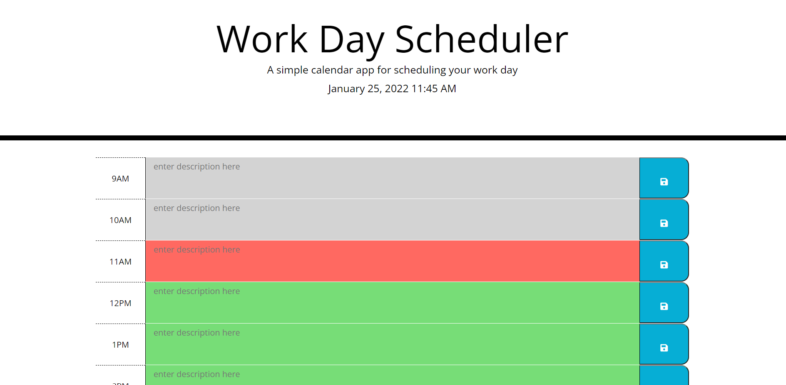

# Work Day Scheduler

## Description
This application can be used to generate a work day calender to allow you to keep track of meeting or any other obligations throughout the day. All events are color coordinated based on time (past/present/future). All scheduled items are fully editable and once saved will still be on that page for you no matter how many times you refresh the screen!

## Built With
* HTML
* CSS
* Javascript
* Bootstrap
* JQuery

## Website
Direct Website URL: https://mtornabene05.github.io/workday-scheduler/

Repository URL: https://github.com/mtornabene05/workday-scheduler

## Screenshots
This is a screenshot of the page part way through the day.

## Contribution
Made with ❤️ by Maria Tornabene